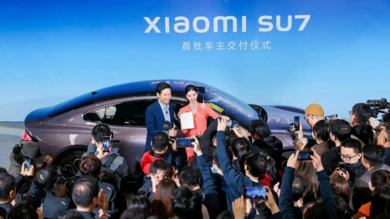

# 雷军：那个在中关村站柜台、输到差点“清盘”的男人，如何熬过3次人生低谷，逆袭成千亿帝国掌门人？

1996年的北京，夜深得像一块化不开的墨。

一个26岁的年轻人，正独自陷在金山软件宽大的沙发里，一根接一根地抽着烟。他叫雷军，时任金山总经理。

他已经好几个晚上没怎么合眼了，只是怔怔地看着对面写字楼的灯，一盏盏熄灭，又看着晨光一点点撕开夜幕，心里反复咀嚼着一个念头：**金山，是不是要在我手里完蛋了？**

二十多年后，当他站在聚光灯下，身后是惊艳世人的小米SU7，在亿万人的欢呼声中，又有谁能想到，这个如今笑得一脸褶子的男人，曾经输到差点“清盘”？

从一个失眠的夜晚，到一个千亿的梦想，他到底经历了什么？今天，我们就来扒一扒雷军那些不为人知的“至暗时刻”，看看这个男人，到底有多能“熬”。

---

### 第一次低谷：梦碎金山，站柜台悟道

雷军的第一次低谷，来得又早又猛。

那时的他，是天之骄子，是WPS之父求伯君最看重的天才程序员。他带领团队，耗时3年，赌上金山几乎所有的家当，开发出了一款叫“盘古”的办公软件，梦想着能与微软一决高下。

结果，1995年Windows 95在中国登陆，如同巨浪拍向沙滩，“盘古”瞬间被拍得粉碎。产品卖不出去，公司账上只剩下十几万，连下个月的工资都发不出来。

骄傲的顶尖程序员，第一次尝到了惨败的滋味。他想不通，这么好的产品，为什么没人买？

他做了一个决定：**去一线，站柜台卖软件！**

在北京中关村最大的软件店里，雷军放下了所有的身段，像个新人一样，跟在金牌销售后面学习，帮用户装软件，陪着笑脸一遍遍介绍产品。第一天，站了8个小时，一套没卖出去。第二天，第三天，依旧颗粒无收。

直到一个星期后，他才慢慢摸到门道。也正是在那段日子里，他被用户“教育”了千百遍，终于悟了：**闭门造车，造出来的只是“艺术品”，而不是用户真正需要的产品。**

这次惨败，没有打垮他，反而让他完成了职业生涯中最重要的蜕变。“用户至上”这四个字，从此被他刻进了骨子里。

---

### 第二次低谷：财务自由后的“中年危机”

2007年，金山上市，雷军功成身退。卖掉卓越网，38岁的他实现了财务自由，本可以彻底躺平，过上神仙般的日子。

但他却陷入了第二次，也是最痛苦的一次低谷——**精神上的“中年危机”**。

那几年，他眼睁睁地看着BAT（百度、阿里、腾讯）这些后辈们，在互联网的浪潮之巅乘风破浪，而自己，一个互联网的“老兵”，却感觉完美地错过了整个时代。

“我就像一个上错了车的旅客，眼看着窗外的风景飞驰而过，心里那种感觉，真是五味杂陈。”

那段时间，他成了圈内最勤奋、最著名的天使投资人，不是在开会，就是在去开会的路上。他投出了一个个成功的项目，钱赚得越来越多，但心里的洞，却越来越大。他反复问自己：**难道我这辈子，就只能看着别人改变世界吗？**

不甘心，是他内心最真实的火焰。这团火，最终在他40岁那年，熊熊燃起。

---

### 第三次低谷：All in造车，人生最后一次创业

如果说创办小米是雷军的第二次生命，那么All in造车，就是他主动为自己选择的第三次“豪赌”。

当所有人都以为他会守着小米帝国，安享晚年时，50多岁的他，再次选择了一条最难走的路。

在小米汽车的发布会上，当他喊出那句：**“这是我人生最后一次创业，我愿意押上我人生所有积累的战绩和声誉，为小米汽车而战！”**全场沸腾。

这不再是为了财务自由，也不是为了商业版图，这只是一个纯粹的极客，对自己梦想的终极致敬。他想造一台“梦想之车”，一台能让每个人都享受科技乐趣的酷产品。

---

### 结语

回顾雷军这三十年，就像坐过山车。他登过巅峰，也摔进过谷底；被捧上过神坛，也被骂到过狗血淋头。

但真正牛逼的人，从来不是那些从不失败的人，而是那些在泥潭里摔倒了，还能抓起一把泥，笑着站起来继续往前走的人。

我们大多数人，没有他那样的天赋和机遇，但我们每个人，都会遇到自己的“盘古”卖不出去的时候，都会有感觉自己“错过一个时代”的焦虑，都会面临“要不要再拼一次”的抉择。

雷军的故事告诉我们，人生最坏的结果，无非是大器晚成。

所以，别怕。

**永远相信，美好的事情，即将发生。**