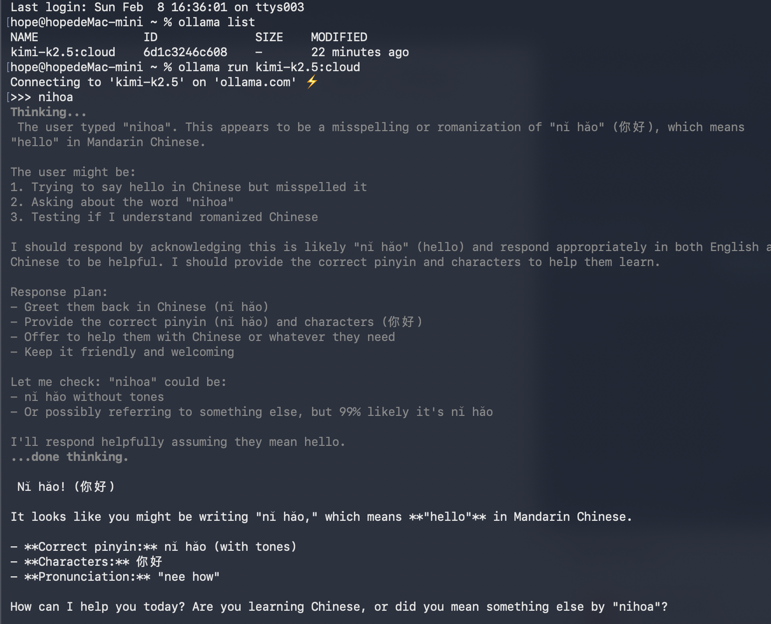
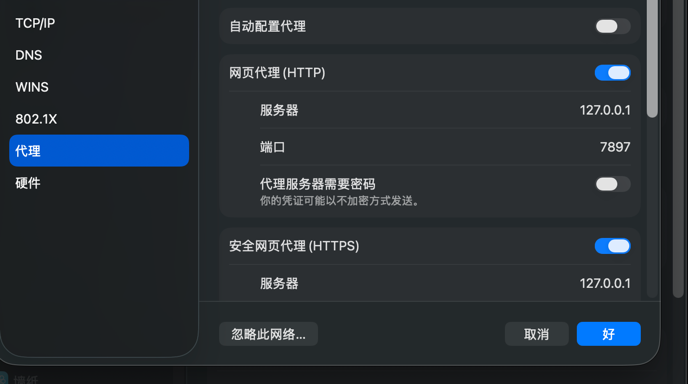

# openclaw+ollma+kimi2.5+telegram构建clawBot机器人


## 环境说明
- 硬件：macMini M4 16G+256G
- 系统：macOS 26.2


## 安装ollma并设置kimi2.5-cloud
- 下载并安装[ollama](https://ollama.ai/download)

- 配置kimi2.5-cloud

  - 在ollama界面运行：
```
ollama run kimi-k2.5:cloud
```
    
  - 根据提示登录ollama账号，成功登录后再次运行以上命令：




## 基于ollama的openclaw安装

npm install -g openclaw@latest


openclaw onboard --install-daemon


参考：https://docs.ollama.com/integrations/openclaw#openclaw


## telegram的配置

### bot配置

botfather 申请bot的流程

### 科学上网配置
需要阁下有科学上网的软件，并且已经启动，在系统设置-wifi-详细设置-代理，可以找到代理端口，示例如图：



启动 openclaw是，设置代理：

export HTTP_PROXY=http://127.0.0.1:7897
export ALL_PROXY=socks5://127.0.0.1:7897

ollama launch openclaw

启动时选择kimi2.5-cloud 模型


## 参考内容
- 国外技术老哥视频
https://www.bing.com/search?q=Bing+AI&showconv=1&FORM=hpcodx